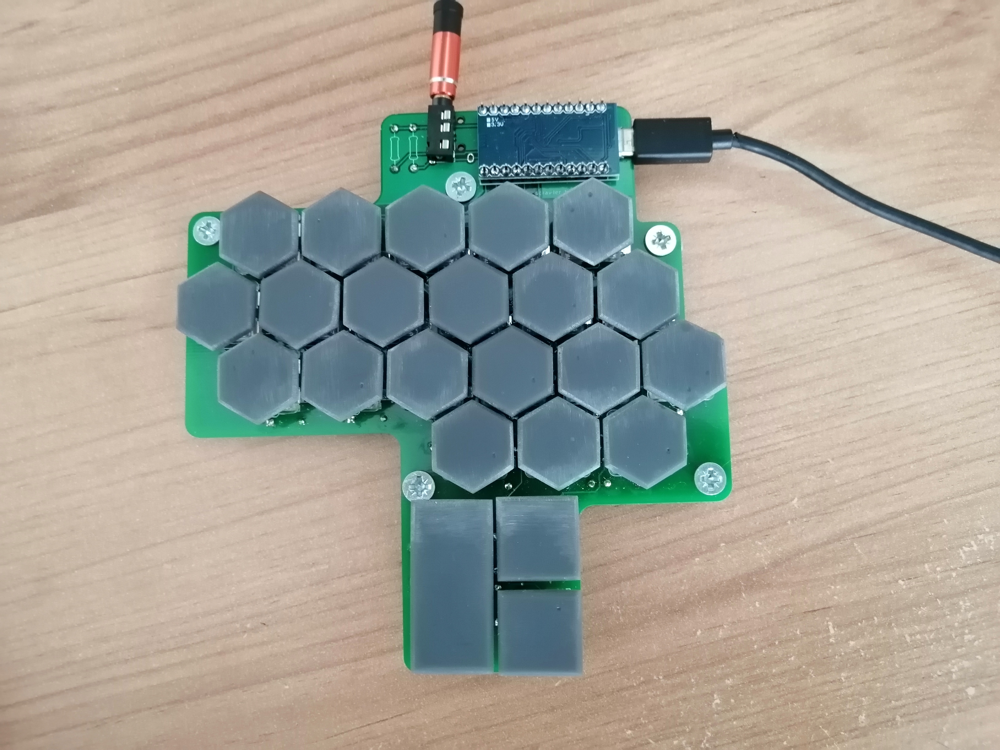
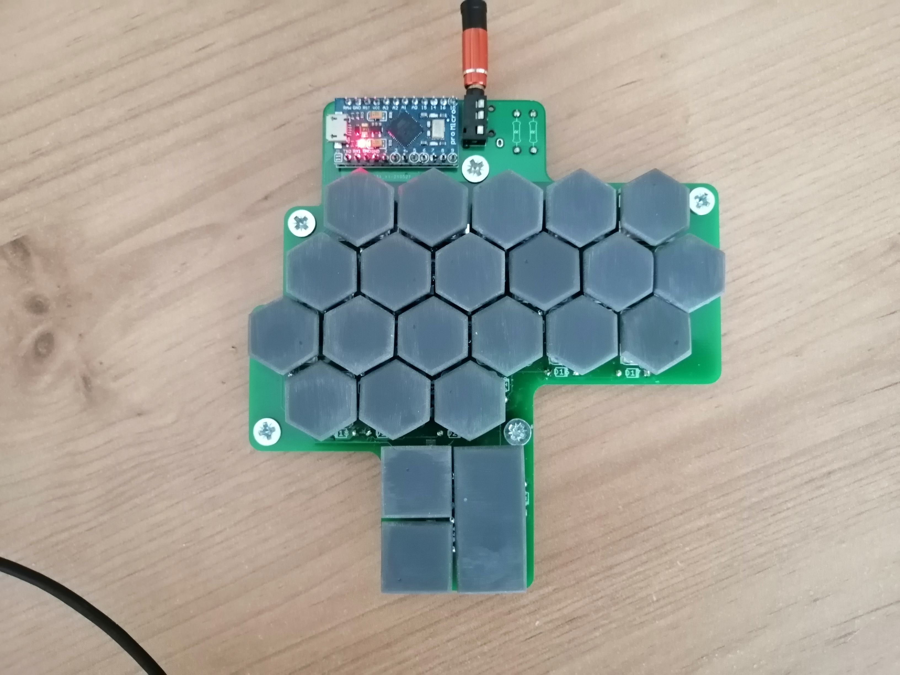
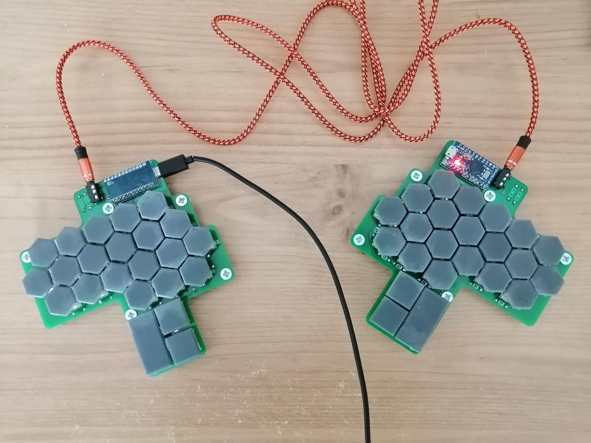

# scrawler
the scrawler is the name of this keyboard

this repo contains all my notes, pcb designs, and cad files for 3d print for the scrawler

to do:

low profile

do mega32u4 manually

cut down on pcb area

smaller thumb keys

more stable keycap stems

simple case, dont clasp

fix delay/keys registering twice

test it

for side thumbs:

more comfortable

against side thumbs:

harder to make case

high profile (but mpu would fit)

more expensive
