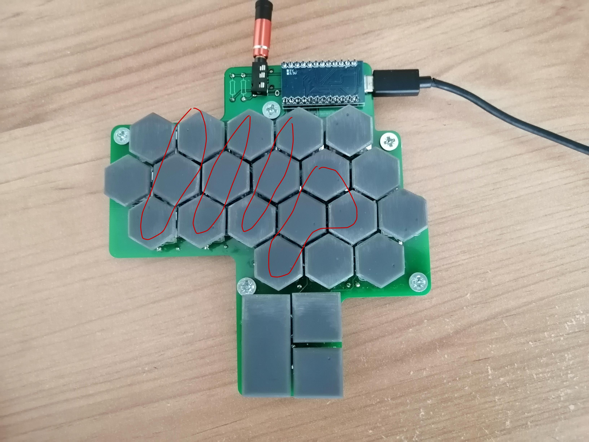
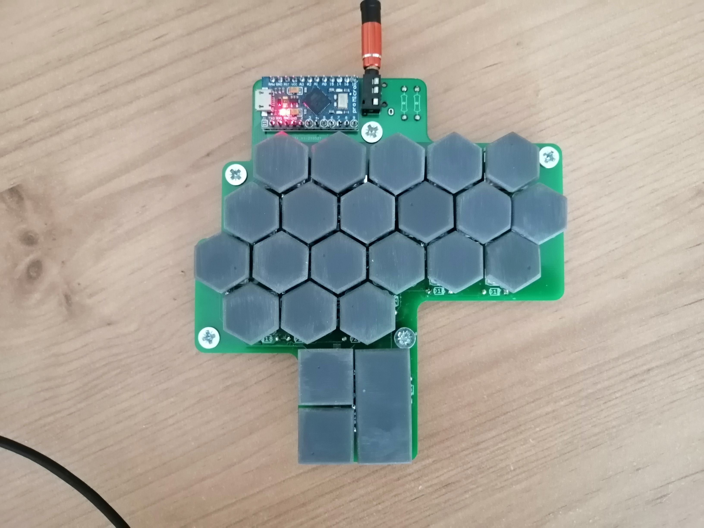

# Scrawler
The name of this keyboard is Scrawler

It was inspired by this YouTube video: https://www.youtube.com/watch?v=thOifuHs6eY

This repository contains all my notes, PCB designs, and CAD files for 3D print for the Scrawler

Below is my first prototype:

I am working on a 2nd prototype. It looks much better and feels better to use. However, I don't have the funds currently to continue developing it. I plan to continue work on it as soon as I have some money.
